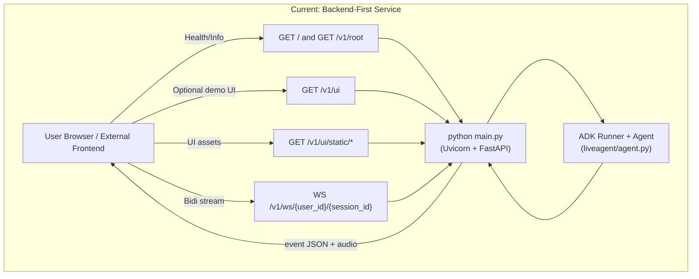
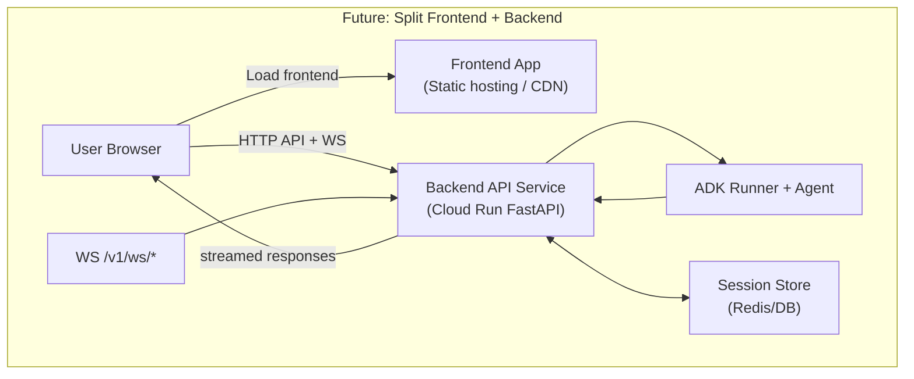
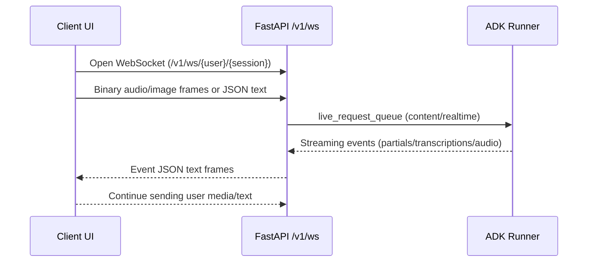

# Architecture Overview

This project is now backend-first with a versioned API (`/v1/*`) and optional built-in UI for testing.

## 1) Current Architecture (Backend-First, Optional UI)

### Current endpoint map
- Backend info: `/`, `/v1/root`
- Primary websocket: `/v1/ws/{user_id}/{session_id}`
- Optional built-in UI: `/v1/ui`
- Backward compatibility: `/ui`, `/ws/{user_id}/{session_id}`

### Protocol summary
- Text input: JSON text frame (`{"type":"text","text":"..."}`)
- Binary framed media: `LG + frame_type + payload`
  - `0x01` = PCM16 audio (`audio/pcm;rate=16000`)
  - `0x02` = JPEG image (`image/jpeg`)

---

## 2) Target Architecture (Split Frontend + Backend Service)

### Why this split
- Reuse one backend across multiple UIs.
- Independent frontend/backend deployments.
- Better scaling path with shared session store.

---

## 3) Stream Lifecycle (Current)

