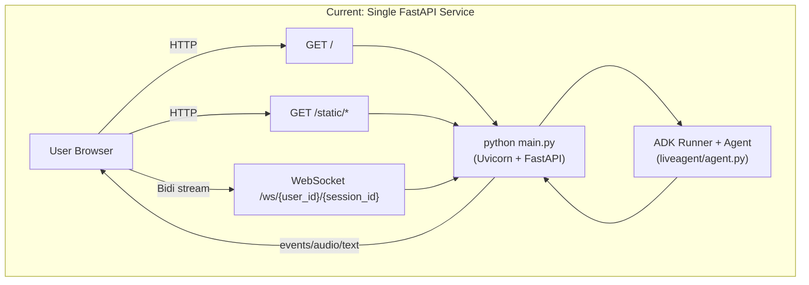
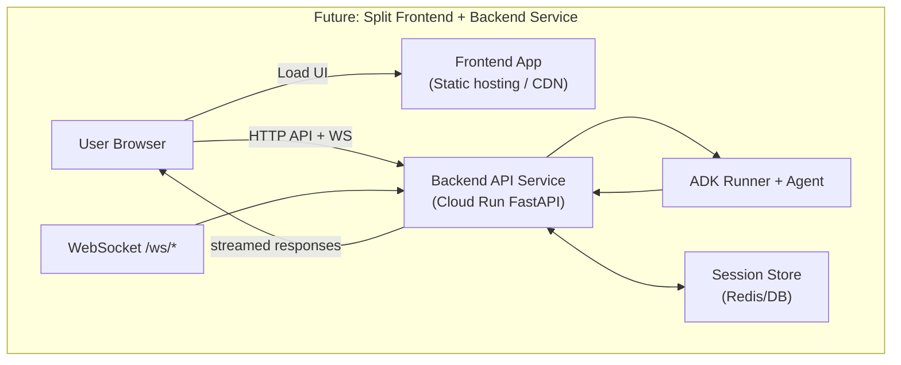

# Architecture Overview

This document captures the current runtime architecture and the target split architecture.

## 1) Current Architecture (Single FastAPI Service)

### Notes
- One process serves frontend assets and backend websocket/API.
- Browser opens websocket to the same host/port.
- ADK runner and agent execute inside the same backend process.

---

## 2) Target Architecture (Split Frontend + Backend)

### Notes
- Frontend is deployed independently from backend.
- Multiple frontends can reuse the same backend service.
- Shared session store is recommended for Cloud Run scaling.
